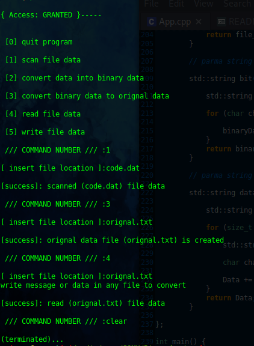

# BinaryApp

- Name : "BinaryApp"

- Description : "binary data convertor system as Console base Application Program"

- Version : main

- Update : 25-03-2024

- Status : COMPLETED

- TechStack : { C++ }

- Thanks : { GitHub | VSCodium | Linux }

- Collabrate : { Self }

- URL : <https://github.com/MayankDevil/BinaryApp/>

#### Project Look & Feel



#### Requirement to use

-  change directory get in source _./src_

```

cd ./src

```
-  compile C++ application program

```

g++ -Wall -o main App.cpp

```
-  run executable file in terminal

```

./main

```

### Copyright Notice

Copyright (c) by _Mayank_ All Rights Reserved.                *

__This Project is the property of Mayank and is protected under copyright law. Unauthorized reproduction, distribution, or disclosure of this Project , or any part of its contents, is strictly prohibited.__

For permissions, please contact the repository owners through their GitHub profiles:

[](https://github.com/MayankDevil/)

Any unauthorized use of the material within this repository may constitute a violation of copyright law. Use only services.

